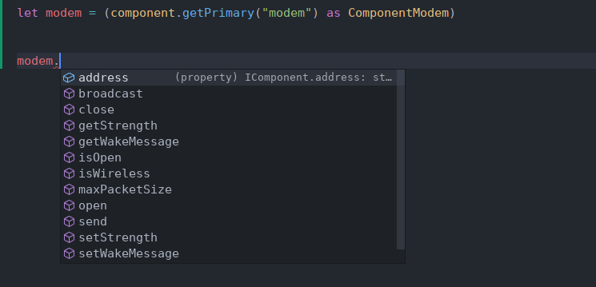
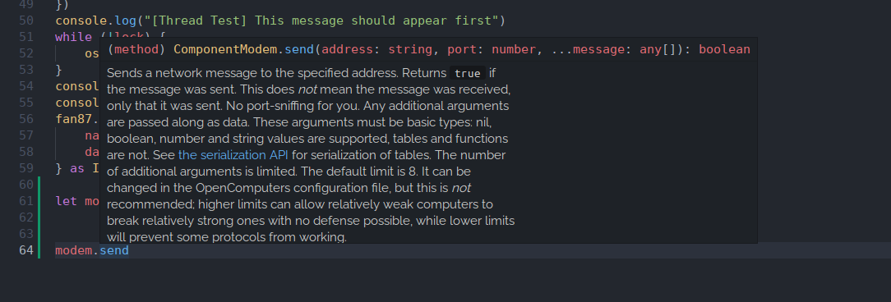
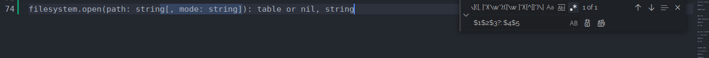

 

# OpenComputers - Typescript Binding

An unofficial OpenComputers binding/declaration for Typescript 

## Features



:arrow_up: Code Completion (Since it's static typed.)



:arrow_up: JSDoc, so you can understand what the function does without going to OpenComputer's docs every 5 second.


:arrow_up: Integration support. For more information, please check the chapters below.

## Setup

In-order to use this binding, you have to use [`TypescriptToLua`](https://typescripttolua.github.io/).You can check its [Getting Started](https://typescripttolua.github.io/docs/getting-started) chapter for setting TypescriptToLua up.

After that, you can start adding dependencies and set this up.

1. `npm install -D lua-types` & `npm install --save @types/node` (uh so I don't know how to put it together in one command forgive me as I said I don't use Node.js that much :skull:)
2. Modify `tsconfig.json` to something like this:

```json
{
    "compilerOptions": {
        "outDir": "dist/", // Change it to anything you like
        "types": ["typescript-to-lua/language-extensions", "lua-types/5.2", "opencomputers-type-declaration"], // Language extension provides types like `LuaMultiReturn`, and lua-types provides type declaration of lua's standard library
        "target": "es6" // Langauge Extensions dies without it. Don't know why, and it's probably not the best way to fix this, but it works
    },
    "include": [
        "src/*.ts", // Include all typescript files
    ],
    "tstl": {
        "noHeader": true, // Well, if you want to, you can add headers back
        "luaTarget": "5.3" // OpenComputer supports 5.3, so I'll be using 5.3 in this case
    }
}
```

3. Modify the `package.json`:

```json
  "scripts": { // Add this block
    "clean": "rm -rf dist/", // Uh well this is not the best way. In gradle I know it's easy to delete a file, but I don't know anything about npm/node.js
    "build": "npm run clean; mkdir -p dist/; cp src/*.lua dist/; tstl -p tsconfig.json" // Delete the dist/ directory (clean), create dist, copy lua files to dist, and compile everything
  },
  "devDependencies": { // VERIFY IT'S SOMETHING LIKE THIS! You don't need to add this manually
    "@types/node": "^17.0.31",
    "lua-types": "^2.11.0",
    "typescript-to-lua": "^1.4.3"
  }
```

4. If you want to learn more, please check the `test.ts` in the GitHub repository

## Writing Declaration - Tutorial/Guide

> :information_source: This is a cheat sheet. If you want a full guide, please check [this document](https://typescripttolua.github.io/docs/advanced/writing-declarations) instead.

 First, we want to take a look at lua's declaration that will be written in document of most Lua APIs:

`filesystem.open(path: string[, mode: string]): table or nil, string`

The `[]` means it's optional, so here's what it should look like after the first step.:

`filesystem.open(path: string, mode?: string): table or nil, string`

If there are like 20 functions and you are lazy to replace all of them manually, you can do a little troll. First, Ctrl + F, then click on the expand arrow on the left side. Search for `([^<])\[([, ]*)(\w*):([\w ]*)([^[]*)\]`, enable regex (The third buttom, the `.*` one), and replace them with `$1$2$3?: $4$5`. After replacing all, it should be replaced automatically. But it only allows you to replace parameter type, return types aren't included, so you still have to replace return types manually.



Then, replace `or` with `|`

`filesystem.open(path: string, mode?: string): table | nil, string`

`nil` = `null`:

`filesystem.open(path: string, mode?: string): table | null, string`

the `null, string` was tuple, and you should replace it with `LuaMultiReturn`:

`filesystem.open(path: string, mode?: string): table | LuaMultiReturn<[null, string]>`

Now, you should figure out what it returns and create interface of it. In this case, it returns a `File` object:

```typescript
interface File {
    /**
     * Closes the file stream, releasing the handle on the underlying file system.
     */
    close(): void

    /**
     * Tries to read the specified number of bytes from the file stream. Returns the read string, which may be shorter than the specified number. Returns `nil` when the end of the stream was reached. Returns `nil` and an error message if some error occurred.
    */
    read(n: number): string | LuaMultiReturn<[null, string]>
    
    /**
     * Jumps to the specified position in the file stream, if possible. Only supported by file streams opened in read mode. The first parameter determines the relative location to seek from and can be `cur` for the current position, `set` for the beginning of the stream and `end` for the end of the stream. The second parameter is the offset by which to modify the position. Returns the new position or `nil` and an error message if some error occurred.The default value for the second parameter is 0, so `f:seek("set")` will reset the position to the start of the file
     */
    seek(whence: string, offset: number): number | LuaMultiReturn<[null, string]>
    
    /**
     * Writes the specified data to the stream. Returns `true` on success, `null` and an error message otherwise.
     */
    write(str: any): boolean | LuaMultiReturn<[null, string]>
}
```

And the declaration should now be

```
open(path: string, mode?: string): File | LuaMultiReturn<[null, string]>
```

Now we got a declaration line, let's add it into `liboc.d.ts`. If it requires `require("blablabla")`, add them as module:

```typescript
// If it's not something like `filesystem:open`, you have to add @noSelf annotation
// Or if some of them requires `:`, and some of them uses `.`, you have to not do the `@noSelf`, and add `this: void` as parameter to all functions that uses `.`
/**
 * @noSelf
*/
declare module "filesystem" {
	// You have to add `export function` before the translated declaration
    export function open(path: string, mode?: string): File | LuaMultiReturn<[null, string]>
    
    interface File {
        /**
         * Closes the file stream, releasing the handle on the underlying file system.
         */
        close(): void

        /**
         * Tries to read the specified number of bytes from the file stream. Returns the read string, which may be shorter than the specified number. Returns `nil` when the end of the stream was reached. Returns `nil` and an error message if some error occurred.
        */
        read(n: number): string | LuaMultiReturn<[null, string]>
        
        /**
         * Jumps to the specified position in the file stream, if possible. Only supported by file streams opened in read mode. The first parameter determines the relative location to seek from and can be `cur` for the current position, `set` for the beginning of the stream and `end` for the end of the stream. The second parameter is the offset by which to modify the position. Returns the new position or `nil` and an error message if some error occurred.The default value for the second parameter is 0, so `f:seek("set")` will reset the position to the start of the file
         */
        seek(whence: string, offset: number): number | LuaMultiReturn<[null, string]>
        
        /**
         * Writes the specified data to the stream. Returns `true` on success, `null` and an error message otherwise.
         */
        write(str: any): boolean | LuaMultiReturn<[null, string]>
    }
}

```

Or.. if it should be an interface (For example, components should be interface since you don't have to do `require()`, but instead do `component.getPrimary()` or `component.proxy()` etc.)

```typescript
// If it's not something like `filesystem:open`, you have to add @noSelf annotation
// Or if some of them requires `:`, and some of them uses `.`, you have to not do the `@noSelf`, and add `this: void` as parameter to all functions that uses `.`
/**
 * @noSelf
*/
interface FileSystem {
	// You have to add `export function` before the translated declaration
    open(path: string, mode?: string): File | LuaMultiReturn<[null, string]>
}

interface File {
    /**
     * Closes the file stream, releasing the handle on the underlying file system.
     */
    close(): void

    /**
     * Tries to read the specified number of bytes from the file stream. Returns the read string, which may be shorter than the specified number. Returns `nil` when the end of the stream was reached. Returns `nil` and an error message if some error occurred.
    */
    read(n: number): string | LuaMultiReturn<[null, string]>
    
    /**
     * Jumps to the specified position in the file stream, if possible. Only supported by file streams opened in read mode. The first parameter determines the relative location to seek from and can be `cur` for the current position, `set` for the beginning of the stream and `end` for the end of the stream. The second parameter is the offset by which to modify the position. Returns the new position or `nil` and an error message if some error occurred.The default value for the second parameter is 0, so `f:seek("set")` will reset the position to the start of the file
     */
    seek(whence: string, offset: number): number | LuaMultiReturn<[null, string]>
    
    /**
     * Writes the specified data to the stream. Returns `true` on success, `null` and an error message otherwise.
     */
    write(str: any): boolean | LuaMultiReturn<[null, string]>
}
```


Another example with `function` as parameter:

`test(predict: function)` (This function doesn't actually exist)

Now, let's assume the predicate function takes `any` as parameter, and returns `boolean`. It really depends on the context, most documents won't write what it should be, you have to somehow figure out what's the parameter type and the return type.

`test(predicate: (value: any) => boolean)`

Well, it doesn't have a return type, which is not great. You should use `void` as return type:

`test(predicate: (value: any) => boolean): void`


Also if there is description in the official document, you should add JSDoc. Please check `liboc.d.ts` for examples.

## Coverage

1. Full integartion of IC2 provided by OC

   - Requires `Adapter` block

   1. Energy interface (TileEntities that can store energy inside)
   2. Cable/Conductor
   3. Reactor/Chamber/Redstone Port
   4. MassFab

2. Full integration of Minecraft provided by OC

   - Requires `Adapter` block

   1. Beacon
   2. Brewing Stand
   3. Command Block
   4. Comparator
   5. **NOT FINISHED** Fluid Handler (Unknown purposes, but it's provided by OC)
   6. **NOT FINISHED** Fluid Tank (Unknown purposes, but it's provided by OC)
   7. Furnace
   8. Inventory
   9. Mob Spawner
   10. Note Block
   11. Juke Box (Record Player)

3. Full integration of Refined Storage provided by Refined Storage

   - Requires `Interface` block

4. Full integration of Minecraft Forge provided by OC

   - Requires `Adapter` Block

   1. Forge Energy Storage

5. Full integration of Ender Storage provided by OC

   - Requires `Adapter` Block

6. Still WIP OpenGlasses support

   - planned

7. Full OpenOS API

8. Full OpenComputer's Standard Library

9. Every single built-in components

## Contribution

If you would like to add a type declaration of an integration, and you would like to share your work and let other people use it, please open a GitHub issue or do a pull request, thank you : D

## About my hand

RIP my hand. I typed most of them by myself :skull:. I mean some of them are automatically generated, but in the end I still haven't figured out a way to translate lua function declaration to Typescript's. First reason is that the OpenComputer's wiki is kinda shit, the declaration has typo (which kills the translator), and it uses different method on some pages. Just an example, what my script expected was `[a: any[, b: any]]`, and that's what it is in most pages, but it somehow is `[a: any, b: any]` in some pages, and in fact there are a lot of similar things, so I decided to translate them manually.

It only took me around 8 hours, you're very welcome. 

https://www.youtube.com/watch?v=CQcwqrKwSiU
